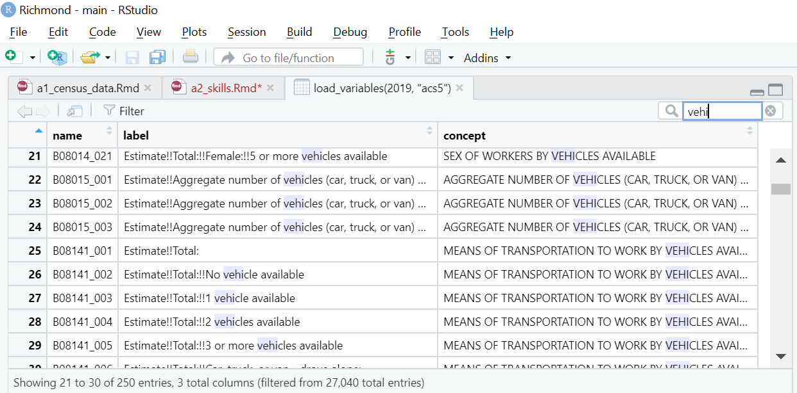

```{r setup, include=FALSE}
knitr::opts_chunk$set(echo = TRUE)
```

# Overview

The followings skills will be useful for Analysis Assignment 2. They are listed here alphabetically. I don't want to bias your thinking about which ones you'll end up using and in what order. But this page will be a useful reference.

*Note: In general, you should load all your libraries at the beginning of your script or markdown file. In these examples, I'm loading libraries at the top of each code chunk to make it more clear which methods use which packages.*

* **Apply a ggplot theme:** You have a lot of flexibility in designing your ggplot charts and maps, but some pre-defined themes can save you some time on that.
* **Collapse data:** This is useful if you want to collapse block-level data to the tract level, or tract-level data to the region level.
* **Create a chloropleth map:** A static chloropleth map is a useful way to display variation across space on a figure you want to include in report.
* **Create a dot-density map:** A dot-density map can be useful for visualizing how the densities of things in one or more categories vary across space, without having to actually calculate densities.
* **Create a histogram:** A histogram is a helpful way to illustrate the variation in a variable.
* **Create an interactive map:** Even if your deliverable will be all static content in a report, it can be helpful to create an interactive map for your own use to explore the geography of your study area.
* **Create a tree map:** Tree maps are nice way to visualize proportions. 
* **Customize axes and legends:** You'll likely want to define titles for the axes and legends on any graphics you create. You might also want to control how number are displayed on axes and legends.
* **Define a color ramp:** There are several predefined color palettes you can use, and some useful functions you can use to select colors in `ggplot`.
* **Download census tract data:** You'll need to download several tract-level variables from the census. You'll find the `tidycensus` and `tigris` packages useful for this.
* **Download employment data:** The Longitudinal Employer-Household Dynamica (LEHD) dataset is a great source of census-block level employment data by industry.
* **Find census variables:** You'll need to search for the names of the variables you want to include in your analysis.
* **Join two data frames:** If you have employment data in one dataframe and population data in another, you'll want to combine them into a single dataframe.
* **List census variable names:** Once you've identified the census variable you want to include in your analysis, you can create a list of them in which you define your own variable names.
* **Write data to a file:** When you have all the data how you want it, you should save it so you can use it for subsequent assignments. 
* **Write figures to a file:** Creating maps and charts in RMarkdown is great, but you'll eventually want to save them as files you can include in a report or presentation.

# Apply a ggplot theme

You have a lot of flexibility in designing your ggplot charts and maps, but some pre-defined themes can save you some time on that.

```{r, include=FALSE}
library(tidyverse)
library(here)

zones <- here("Examples",
              "data",
              "hi_zone_data.csv") %>%
  read_csv() %>%
  mutate(pct_no_veh = no_vehE / total_hhsE)

hist <- ggplot(zones) +
  geom_histogram(aes(x = pct_no_veh))
```

Here's a histogram with the default theme (see how you would have created it in the "Create a histogram" topic).

```{r, message=FALSE, warning=FALSE}
hist
```

`theme_bw()` gives a nice, clean look.

```{r, message=FALSE, warning=FALSE}
hist +
  theme_bw()
```

If you want to try something even more minimal, you could try `theme_minimal()`

```{r, warning=FALSE, message=FALSE}
hist +
  theme_minimal()
```

There are a few other themes included in `tidyverse`. To see your options, just start typing `theme_` and some autocomplete options will appear.

If you want even more themes to choose from, you could try the `ggthemes` package. `theme_few()` is based on guidelines from [Stephen Few](http://www.stephen-few.com/smtn.php){target={"_blank"}.

```{r, message=FALSE, warning=FALSE}
library(ggthemes)

hist +
  theme_few()
```

`theme_tufte()` is based on guidelines from [Edward Tufte](https://www.edwardtufte.com/tufte/books_vdqi){target="_blank"}.

```{r, warning=FALSE, message=FALSE}
library(ggthemes)

hist +
  theme_tufte()
```

For maps, `theme_map()` can be a good choice. If you've [created a chloropleth map](https://gsd-ses-5394-sp2023.github.io/skills/a2.html#create-a-chloropleth-map) called `hh_size_map`, you could apply `theme_map()` like this. 

```{r, include=FALSE}
library(sf)

census <- st_read(here("Examples",
                       "data",
                       "hi_zone_data.geojson")) %>%
  mutate(avg_hh_size = (hh_1personE +
           2 * hh_2personE +
           3 * hh_3personE +
           4 * hh_4person_plusE) / total_hhsE)

hh_size_map <- ggplot(census) +
  geom_sf(aes(fill = avg_hh_size), color=NA)
```

```{r}
library(ggthemes)

hh_size_map +
  theme_map()
```

That will overlap the legend with the map, which you won't always want. `theme_void()` can be a good alternative.

```{r}
library(tidyverse)

hh_size_map +
  theme_void()
```

# Collapse data

This is useful if you want to collapse block-level data to the tract level. So for example, you might use it if you just [loaded the LEHD data](https://gsd-ses-5394-sp2023.github.io/skills/a2.html#download-employment-data).

```{r, include=FALSE}
lehd_blocks <- read_csv('https://lehd.ces.census.gov/data/lodes/LODES7/hi/wac/hi_wac_S000_JT00_2019.csv.gz', show_col_types = FALSE) %>%
  rename(total_emp = C000) %>%
  mutate(basic_emp = CNS01+CNS02+CNS03+CNS04+CNS05+CNS06+CNS08+CNS09) %>%
  rename(retail_emp = CNS07) %>%
  mutate(service_emp = total_emp - basic_emp - retail_emp) %>%
  select(w_geocode, total_emp, basic_emp, retail_emp, service_emp)
```

In LEHD data, the GEOID is in a variable called w_geocode, and it's stored as a number, so we'll convert it to a character. The first 11 digits of census block's GEOID indicate the census tract, so we'll use that to create a variable indicating the census tract, and we'll name *that* GEOID. Then we'll drop the `w_geocode` column (by putting a negative sign before its name in the `select()` function). Then we'll use `group_by()` and `summarize()` to collapse the data to the tract level. 

```{r}
library(tidyverse)

lehd_tracts <- lehd_blocks %>%
  mutate(w_geocode = as.character(w_geocode)) %>%
  mutate(GEOID = substr(w_geocode, 1, 11)) %>%
  select(-w_geocode) %>%
  group_by(GEOID) %>%
  summarize(across(everything(), ~sum(.)))
```

Now I have the total employment in each of these categories for every census tract in the state. I'd want to filter that down to just my study area, but if I already have the population data for my study area (see the "Download census tract data" topic) for my study area, I can just join the two dataframes (see the "Join two data frames" topic) and that will take care of the filtering.

# Create a chloropleth map 

A static chloropleth map is a useful way to display variation across space on a figure you want to include in report. You can add your tract polygons to a ggplot and use the aes() function withing the geom_sf() function to indicate which variable the tract colors should represnet. `color=NA` means the map won't draw outlines for the zone boundaries. If you want outlines, you can select a color (for example, `color = "red"`). You can see a list of all the color names R recognizes by typing `colors()` into your console.

```{r}
library(sf)

hh_size_map <- ggplot(census) +
  geom_sf(aes(fill = avg_hh_size), color=NA)

hh_size_map
```

You might want to customize that map further: you could choose a different color ramp, customize the legend, [apply a theme](https://gsd-ses-5394-sp2023.github.io/skills/a2.html#apply-a-ggplot-theme), add a base map, display the street network, or reproject the data.

# Create a dot-density map

A dot-density map can be useful for visualizing how the densities of things in one or more categories vary across space, without having to actually calculate densities. 

Here's how you could create a map showing the approximate distribution of households across your study area, with colors indicating household size.

We'll start by creating five set of points, one for each household size category, where each point represents 100 households, and they are distributed randomly with their respective zones.

It takes a while to create all these points, so be patient (maybe go get a snack while you wait).

```{r}
library(sf)

hh_1person_pts <- st_sample(census, 
                            size = ceiling(census$hh_1personE/100))

hh_2person_pts <- st_sample(census, 
                            size = ceiling(census$hh_2personE/100))

hh_3person_pts <- st_sample(census, 
                            size = ceiling(census$hh_3personE/100))

hh_4person_pts <- st_sample(census, 
                            size = ceiling(census$hh_4person_plusE/100))
```

Then we'll put each of those four sets of points into its own dataframe with a column indicating the household size category, and finally, we'll combine the four sets into a single dataframe.

```{r}
hh_1person_df <- tibble(hh_size = rep("1 person", 
                                      length(hh_1person_pts))) %>%
  st_sf(geom = hh_1person_pts)
                        
hh_2person_df <- tibble(hh_size = rep("2 people", 
                                      length(hh_2person_pts))) %>%
  st_sf(geom = hh_2person_pts)
 
hh_3person_df <- tibble(hh_size = rep("3 people", 
                                      length(hh_3person_pts))) %>%
  st_sf(geom = hh_3person_pts)

hh_4person_df <- tibble(hh_size = rep("4 or more people", 
                                      length(hh_4person_pts))) %>%
  st_sf(geom = hh_4person_pts)

hh_size_pts <- rbind(hh_1person_df, hh_2person_df, hh_3person_df, hh_4person_df)
```

Now we can plot all these points on a map!

I'm making the dots transparent (alpha = 0.3) and tiny (size = 0.1) to avoid overplotting.

The guides() function at the end lets me adjust the dot sizes in the legend.

Keep in mind that a dot-density map like this can be a little deceptive by randomly (and somewhat evenly) distributing points within a zone, and that generally won't match the actual spatial distribuution of the population within zones.

```{r}
ggplot(census) + 
  geom_sf(color = "white") +
  geom_sf(data = hh_size_pts, 
          aes(color = hh_size), 
          alpha = 0.3,
          size = 0.1) +
  scale_color_brewer("Household size\n(each points represents\n100 households)",
                     palette = "Set1") +
  theme_void()  +
  guides(color = guide_legend(override.aes = list(size=5, alpha = 0.6)))
```

# Create a histogram 

A histogram is a helpful way to illustrate the variation in a variable.

```{r, message=FALSE, warning=FALSE}
hist <- ggplot(zones) +
  geom_histogram(aes(x = pct_no_veh))

hist
```

You can change the outline and fill colors of the histgram bars using the `fill` and `color` arguments within `geom_histogram()`. You can see a list of all the color names R recognizes by typing `colors()` into your console.

```{r, message=FALSE, warning=FALSE}
hist <- ggplot(zones) +
  geom_histogram(aes(x = pct_no_veh),
                 fill = "seashell1",
                 color = "thistle4")

hist
```

You could customize the plot further by [applying a theme](https://gsd-ses-5394-sp2023.github.io/skills/a2.html#apply-a-ggplot-theme) or [customizing the axes](https://c-voulgaris.github.io/gsd-ses-5394-sp2023/skills/a2.html#customize-axes-and-legends).

# Create an interactive map

Even if your deliverable will be all static content in a report, it can be helpful to create an interactive map for your own use to explore your data. For example, it's a useful way to find the GEOID for a zone in a specific location.

I'll use the `leaflet` package to create an interactive map. I'll save it to an html file so I can open the file to view in my browser. I'll add a popup so you can click on a zone to get the GEOID ([see the result here](https://c-voulgaris.github.io/gsd-ses-5394-sp2023/Examples/boundaries.html){target="_blank"}).

```{r, eval=FALSE, warning=FALSE}
library(leaflet)
library(htmlwidgets)

map <- census %>%
  st_transform("WGS84") %>%
  leaflet() %>%
  addTiles() %>%
  addPolygons(popup = ~GEOID,
              weight = 1,
              opacity = 1,
              highlightOptions =
                highlightOptions(fillColor = "red"))

saveWidget(map, file = here('Examples/boundaries.html'))
```

# Create a tree map

Tree maps are nice way to visualize proportions.

Let's say I wanted to get the regional share of households that have zero, one, or multiple vehicles. First I'll set up a list of variables with the numbers of households with zero, one, two, three, or more than three vehicles. I'll also separately save the variable name for the total number of households.

```{r}
vars <- c(`Zero vehicles` = 'B08201_002',
          `One vehicle` = 'B08201_003',
          `Two vehicles` = 'B08201_004',
          `Three vehicles` = 'B08201_005',
          `Four or more vehicles` = 'B08201_006')
  
total_hhs <- 'B08201_001'
```

Now I'll get the total values for the full study area.

```{r}
library(tidycensus)

region_vehs <- get_acs(
  geography = "cbsa",
  variables = vars,
  summary_var = total_hhs,
  geometry = FALSE) %>%
  filter(NAME == "Urban Honolulu, HI Metro Area") %>%
  mutate(pct = estimate / summary_est) %>%
  select(variable, pct)
```
Now I can use the `treemapify` package to create a tree map.


```{r}
library(treemapify)

ggplot(region_vehs, aes(area = pct, fill= variable)) +
  geom_treemap(show.legend = FALSE, color = NA) +
  geom_treemap_text(aes(label = paste(variable, "\n",
                                      prettyNum(pct * 100, digits = 1),
                                      "%",sep = "")), 
                        color = "white") +
  scale_fill_brewer(palette = "Set2")
```

# Customize axes and legends

You'll likely want to define titles for the axes and legends on any graphics you create. You might also want to control how number are displayed on axes and legends.

The `scale_...()` fuctions are what you need there. `scale_x_continuous()` refers to the title, tick marks, and tick labels on the x-axis. `scale_y_continuous()` does the same for the y-axis. `scale_fill_continuous()` refers to the legend of you have a figure that uses fill colors to represent the values of continuous variables. In any of these functions, you'll want to define

Here's a histogram with default settings for both axes:

```{r, message=FALSE, warning=FALSE}
hist
```

The legend titles are just the variable names, and ggplot has created and labeled four or five tick marks on each axis. I can change the title of the y-axis by setting the `name` argument in `scale_y_continuous()`. I can specify where I want the tick marks to be by setting the `breaks` argument to a vector of values (a list within a `c()` function). 

```{r, message=FALSE, warning=FALSE}
hist +
  scale_y_continuous(name = "Number of census tracts",
                     breaks = c(0, 20, 40, 60, 80, 100))
```

There are some disadvantages to typing out all the breaks for the tick marks manually. For one thing, it leave a lot of room for error if there's a typo or something. Since you probably want evenly-spaced tick-marks, you can save yourself some typing by using the `seq()` function. The `seq()` function generates a list of numbers from three arguments, the first number, the last number, and the increment value. So if you want numbers that range from zero to 100, increasing by 10, you could type `seq(0, 100, by=10)`.

```{r, message=FALSE, warning=FALSE}
hist +
  scale_y_continuous(name = "Number of census tracts",
                     breaks = seq(0, 100, by =10))
```

I can do the same kind of thing for the x-axis, but this time, I'd like the labels to show up as percentages rather than decimals. I can do this by setting the `labels` argument in `scale_x_continuous()`. So this time, when I create the breaks, I'll also save them to a variable called `my_brks` so I can use it as a starting point to create labels. The paste() function pastes together numbers and/or characters to create a new character string. In this case, I'm taking the value in `my_brks`, multiplying it by 100, and adding a percentage sign to the end. `sep = ""` means I don't want a space between the number and the percentage sign.

```{r, message=FALSE, warning=FALSE}
hist +
  scale_y_continuous(name = "Number of census tracts",
                     breaks = seq(0, 100, by =10)) +
  scale_x_continuous(name = "Percent of households with no vehicles",
                     breaks = my_brks <- seq(0, 1, by = 0.05),
                     labels = paste(my_brks * 100, "%", sep = ""))
```

Some variables have a lot of very small values an a smaller number of larger values. This is common for density, as shown in this histogram.

```{r, include=FALSE}
census <- census %>%
  mutate(hh_dens = total_hhsE / ALAND)

dens_hist <- ggplot(census) +
  geom_histogram(aes(x = hh_dens), color = "lightgray")
```

```{r, message=FALSE, warning=FALSE}
dens_hist
```

In this case, I might find it helpful to log-transform the x-axis by setting `trans = "log"` in the `scale_x_continuous()` function. This doesn't change the data; it just changes how it is displayed.

```{r, message=FALSE, warning=FALSE}
dens_hist +
  scale_x_continuous(trans = "log")
```

With a log-transformed axis, evenly-spaced values for the tick marks wouldn't make sense - you want to values to increase multiplicatively (e.g. 1, 10, 100, 1000...) rather than additively (e.g. 1, 2, 3, 4, 5). I can do that by sequencing powers of 10 ($10^-2 = 0.1$, $10^-1 = 1$, $10^0 = 1$, $10^1 = 10$, $10^2 = 100$, and so on).

```{r, message=FALSE, warning=FALSE}
dens_hist +
  scale_x_continuous(trans = "log",
                     breaks = 10^seq(-2, 3, by = 1))
```

That makes nice, evenly-spaced intervals, but they're in scientific notation. We can use `formatC()` to format them. `format = "d"` means I want to show the numbers as integers and big.mark = "," means I want to use a comma to separate thousands.

```{r, message=FALSE, warning=FALSE}
dens_hist +
  scale_x_continuous(trans = "log",
                     breaks = log_brks <- 1 * 10^seq(-1, 4, by = 1),
                     labels = formatC(log_brks, format = "d", big.mark = ","))
```

You'll probably find `scale_fill_continuous()` useful for the legend on a chloropleth map, and it works the same way. Here's a chloropleth map with its default legend.

```{r}
hh_size_map
```

And here it is with more useful labels on the legend (I'm not advising you use this many tick marks on a color ramp legend - I'm just showing you how to do it).

I'm using `formatC()` to control the number of decimal places to display (`format = "f"` means I want the number to be displayed as a decimal).

```{r}
hh_size_map +
  scale_fill_continuous(name = "Average household size",
                        breaks = size_brks <- seq(1, 4, by = 0.5),
                        labels = paste(formatC(size_brks, 
                                               format="f",
                                               digits=2), 
                                       "People per household"))
```

I can also log-transform a color-ramp. Here's a chloropleth map of residential density.

```{r, include=FALSE}
dens_map <- ggplot(census) +
  geom_sf(aes(fill = hh_dens), color=NA)
```

```{r}
dens_map
```

It's hard to see much variation in the low-density areas. But if we log-transform the scale, the variation becomes more apparent. You'll notice I'm using the exact same arguments in scale_fill_continuous that I used above when I log-transformed the x-axis in a histogram.

```{r}
dens_map +
  scale_fill_continuous(trans = "log",
                     breaks = log_brks <- 1 * 10^seq(-1, 4, by = 1),
                     labels = formatC(log_brks, format = "d", big.mark = ","))
```


# Define a color ramp

There are several predefined color palettes you can use, and some useful functions you can use to select colors in `ggplot`.

The [viridis](https://bids.github.io/colormap/){target="_blank"} color ramps are meant to be colorblind friendly and to reproduce reasonbly well in grayscale (for example, if someone prints your graphic then photocopies it with a black-and-white printer). There are 4 options.

Option A:

```{r}
hh_size_map +
  scale_fill_viridis_c(option = "A")
```

Option B:

```{r}
hh_size_map +
  scale_fill_viridis_c(option = "B")
```

Option C:

```{r}
hh_size_map +
  scale_fill_viridis_c(option = "C")
```

Option D (this is the default if you don't specify an option):

```{r}
hh_size_map +
  scale_fill_viridis_c(option = "D")
```

You can reverse the color ramp values by setting `begin = 1, end = 0`.

```{r}
hh_size_map +
  scale_fill_viridis_c(option = "D", 
                       begin = 1, end = 0)
```

You can also set up your own color ramp using `scale_fill_gradient()` and specifying low and high values. Here's as scale that varies continuously from blue to red.

```{r}
hh_size_map +
  scale_fill_gradient(low = "blue", high = "red")
```

`scale_fill_gradient2()` will let you specify low, medium, and high values. Here's a ramp that varies from green, to yellow, to red (which would be intuitive because of the analogy to a traffic signal, but not accessible for someone with red-green colorblindness). You also need to set a midpoint value - which I'll set as the median value.

```{r}
hh_size_map +
  scale_fill_gradient2(low = "green", mid = "yellow", high = "red",
                       midpoint = median(census$avg_hh_size, na.rm = TRUE))
```

`scale_fill_gradientn()` will let you specify as many colors as you want to include in your color ramp. Here's a ramp that varies from red to orange to yellow to green to blue to purple.

```{r}
hh_size_map +
  scale_fill_gradientn(colors = c("red", 
                                  "orange", 
                                  "yellow", 
                                  "green", 
                                  "blue", 
                                  "purple"))
```

The `RColorBrewer` package offers a bunch of pre-defined palettes that can be useful for continuous data. You can view the options with the function `display.brewer.all()

```{r, fig.height=8}
library(RColorBrewer)

display.brewer.all()
```

The top group of palettes you see above are sequential palettes, which range from dark to light colors.

```{r}
map_palette <- brewer.pal(5, "PuBuGn")

hh_size_map +
  scale_fill_gradientn(colors = map_palette)
```

The last group of colors are diverging palettes, which range from dark to light to dark colors.

```{r}
map_palette <- brewer.pal(5, "Spectral")

hh_size_map +
  scale_fill_gradientn(colors = map_palette)
```

The middle group are qualitative palettes which work well for categorical variables, but would be confusing for a continuous color ramp.

There are some other fun package that define color palettes, including [wesanderson](https://github.com/karthik/wesanderson){target="_blank"} (colors inspired by Wes Anderson films), [PNWColors](https://jakelawlor.github.io/portfolio/pnwcolors/){target="_blank"} (colors inspired by the package author's photos of the Pacific Northwest), [MetBrewer](https://github.com/BlakeRMills/MetBrewer/tree/main){target="_blank"} (inspired by works at the Metropolitan Museum of Art), and [MexBrewer](https://paezha.github.io/MexBrewer/){target="_blank"} (inspired by works of Mexican muralists). These four packages are structured similarly. Some of the available palettes don't work well for continuous variables (the order of the colors isn't intuitive), but some work well.

```{r}
library(MetBrewer)

degas_contin <- met.brewer(name = "Degas", n = 5, type = "continuous")

hh_size_map +
  scale_fill_gradientn(colors = degas_contin)
```

# Download census tract data

You'll need to download several tract-level variables from the census. You'll find the `tidycensus` package super useful for this.

Assuming you've already [defined a list of variables](https://gsd-ses-5394-sp2023.github.io/skills/a2.html#list-census-variable-names) and saved it as a [character vector](https://r4ds.had.co.nz/vectors.html){target="_blank"} called `vars`, you can use the `get_acs()` function in the `tidycensus` package to download the data. 

```{r}
hh_vars = c(no_veh = "B08201_002",
            total_hhs = "B08201_001",
            hh_1person = "B08201_007",
            hh_2person = "B08201_013",
            hh_3person = "B08201_019",
            hh_4person_plus = "B08201_025",
            inc_lt_10k = "B19001_002",
            inc_btw_10k_15k = "B19001_003",
            inc_btw_15k_20k = "B19001_004",
            inc_btw_20k_25k = "B19001_005",
            inc_btw_25k_30k = "B19001_006",
            inc_btw_30k_35k = "B19001_007",
            inc_btw_35k_40k = "B19001_008",
            inc_btw_40k_45k = "B19001_009",
            inc_btw_45k_50k = "B19001_010",
            inc_btw_50k_60k = "B19001_011",
            inc_btw_60k_75k = "B19001_012",
            inc_btw_75k_100k = "B19001_013",
            inc_btw_100k_125k = "B19001_014",
            inc_btw_125k_150k = "B19001_015",
            inc_btw_150k_200k = "B19001_016",
            inc_gt_200k = "B19001_017")
```

I'll use the `get_acs()` function from the `tidycensus` package. `geography = 'tract'` means I want tract-level data. I'll also specify the state and county (or counties - I can provide a list of all the counties in my study area here if there is more than one). In most cases, I'll set `output = wide` because I want each variable in its own column. You'll also need the zone/tract boundaries at some point, so you should get those at the same time by setting `geometry = TRUE`.

In this case, I'm also filtering out tracts with empty geometries and one specific tract 
that represents a set of small islands that have zero population and zero employment -
it may or may not be necessary for you to do something like this for your study area.

```{r, eval=FALSE}
library(tidycensus)

census <- get_acs(geography = "tract",
                              state = "HI",
                              county = "003",
                              variables = hh_vars,
                              output = "wide", 
                              geometry = TRUE) %>%
  filter(!st_is_empty(geometry)) %>%
  filter(GEOID != "15003981200") # small islands with no jobs or hhs
```

You can also get boundaries from the `tigris` package. These will be the same as the ones
returned by `tidycensus`, but they also come with a variable called `ALAND` which indicates
the total land area of the tract (in square meters). 

```{r, results='hide', warning=FALSE, message=FALSE}
library(tigris)

honolulu_areas <- tracts(state = "HI",
                         county = "Honolulu") %>%
  select(GEOID, ALAND) %>%
  st_drop_geometry()
```


# Download employment data

The Longitudinal Employer-Household Dynamica (LEHD) dataset is a great source of census-block level employment data by industry.

You'll find the data you need [here] (https://lehd.ces.census.gov/data/#lodes){target="_blank"}

Select the appropriate state from the drop-down menu, and select 'Workplace Area Characteristics (WAC)' from the 'Type' drop-down menu. Then click the 'View Files' button to see a list of available files. You can read about the file naming conventions [here](https://lehd.ces.census.gov/data/lodes/LODES7/LODESTechDoc7.5.pdf){target="_blank"}. The one you want is called [xx]_wac_S000_JT00_2019.csv.gz, where xx is the two-letter postal code for the state. Right-click on the link for the file and select 'copy link address'.

You can read in the file to R directly from that link. That file has 53 variables in it. The ones you want give the number of workers by industry code. See page 7 of [this document](https://lehd.ces.census.gov/data/lodes/LODES7/LODESTechDoc7.5.pdf){target="_blank"}. You'll want:

* Total workers (C000)
* Basic employment 
    + Agriculture, Forestry, Fishing, and Hunting (CNS01)
    + Mining and extraction (CNS02)
    + Utilities (CNS03)
    + Construction (CNS04)
    + Manufacturing (CNS05)
    + Wholesale trade (CNS06)
    + Transportation and warehousing (CNS06)
* Retail employment (CNS07)
* Service employment (total - basic - retail)

So you can use `select()` to keep those (and use `mutate()` to calculate service employment) and drop everything else (make sure you also keep w_geocode, which has the GEOID for the block). 

This data is at the census block level, not the tract level. You'll need to collapse it to the tract level (see the "Collapse data" topic).

```{r, eval=FALSE}
library(tidyverse)

lehd_blocks <- read_csv('https://lehd.ces.census.gov/data/lodes/LODES7/ny/wac/ny_wac_S000_JT00_2019.csv.gz', show_col_types = FALSE) %>%
  rename(total_emp = C000) %>%
  mutate(basic_emp = CNS01+CNS02+CNS03+CNS04+CNS05+CNS06+CNS08+CNS09) %>%
  rename(retail_emp = CNS07) %>%
  mutate(service_emp = total_emp - basic_emp - retail_emp) %>%
  select(w_geocode, total_emp, basic_emp, retail_emp, service_emp)
```

# Find census variables

You'll need to search for the names of the variables you want to include in your analysis.

If you've already loaded the `tidycensus` package, you can type `View(load_variables(2019, "acs5"))`**\*** into your console to interactively search for variables that you'd like to include in your analysis. That will open a table of all the available variables in your viewer. Here's what you'll see if you start searching for variables that have to do with vehicles:



You'll see that the table has three columns. 

* The first column is the variable name. The variable name will have two parts: the part before the underscore tells you which table the variable is a part of, that the part after the underscore tells you which row the variable is in. 
* The second column is the variable label. This describes that specific variable.
* The third column, called "concept," is the name of the table identified in the first part of the variable name.

Many tables are cross-tabulations that present the number of people, homes, or households in each combination of two categories. Many values can be found in multiple tables. For example, you can find the total number of workers who commute to work by car in B08006 (Sex of worker by means of transportation to work) and B08101 (Means of transportation to work by age).

**\*** *The first argument (`2019`) indicates that you want the variables that are available for 2019 and the second argument (`"acs5"`) indicates that you want variables that are included in the 5-year sample of the American Community Survey. The 5-year sample is from survey respondents pooled over a 5-year period. An alternative is `"acs1"`, which would give you just the households who completed the survey in 2019 (which is a much smaller sample, so those estimates would have more uncertainty associated with them). You could also specify `"sf1"` instead of `"acs5"` or `"acs1"` if you wanted data from the decennial census. The decennial census is meant to include everyone, so there is no sampling error, but fewer variables are available. The 2020 decennial census hasn't been released yet, but you can get a very limited set of variables from the redistricting data -- use `"pl"` rather than `"sf1"` in that case.*

# Join two data frames

If you have employment data in one dataframe (see the "Download employment data" topic) and population data in another (see the "Download census tract data" topic), you'll want to combine them into a single dataframe.

In these examples, I know my population data only includes tracts in my study area because I filtered to to my study area boundary. My employment data is for the whole state. I'll do a left join, with the population data on the left (i.e. listed first), which wil drop all the rows of the employment data that aren't include in my population data.

```{r, results='hide'}
zones <- left_join(census, lehd_tracts)
```

A quick review on what the pipe (`%>%`) does. It takes the output of the function before it and enters it as the first argument in the function after it. So the line in the chunk above this is exactly the same as the following lines with a pipe:

```{r, eval=FALSE}
zones <- census %>%
  left_join(lehd_tracts)
```

# List census variable names

Once you've identified the census variable you want to include in your analysis (see the "Find census variables" topic), you can create a list of them. The function `c()` lets you list a bunch of items so you can pass them into another function (for example, the `get_acs()` function - see the "Download census tract data" topic) as a single argument. You could just list all the variable names you've identified like this:

```{r}
vars <- c('B08203_001',
          'B08203_002',
          'B08201_007',
          'B08201_013',
          'B08201_019',
          'B08201_025',
          'B19001_002',
          'B19001_003',
          'B19001_004',
          'B19001_005',
          'B19001_006',
          'B19001_007',
          'B19001_008',
          'B19001_009',
          'B19001_010',
          'B19001_011',
          'B19001_012',
          'B19001_013',
          'B19001_014',
          'B19001_015',
          'B19001_016',
          'B19001_017')
```

But remember that you don't only want computers to be able to read your code. You want humans (including your future self) to be able to read it too. To that end, you can also define more intelligible variable names when you list your variables.

```{r}
vars <- c(total_hhs = 'B08203_001',
          no_veh = 'B08203_002',
          hh_1person = 'B08201_007',
          hh_2person = 'B08201_013',
          hh_3person = 'B08201_019',
          hh_4person_plus = 'B08201_025',
          inc_lt_10k = 'B19001_002',
          inc_btw_10k_15k = 'B19001_003',
          inc_btw_15k_20k = 'B19001_004',
          inc_btw_20k_25k = 'B19001_005',
          inc_btw_25k_30k = 'B19001_006',
          inc_btw_30k_35k = 'B19001_007',
          inc_btw_35k_40k = 'B19001_008',
          inc_btw_40k_45k = 'B19001_009',
          inc_btw_45k_50k = 'B19001_010',
          inc_btw_50k_60k = 'B19001_011',
          inc_btw_60k_75k = 'B19001_012',
          inc_btw_75k_100k = 'B19001_013',
          inc_btw_100k_125k = 'B19001_014',
          inc_btw_125k_150k = 'B19001_015',
          inc_btw_150k_200k = 'B19001_016',
          inc_gt_200k = 'B19001_017')
```

# Write data to a file

To write spatial data, I suggest saving it to a geojson file using `st_write()`. st_write() can write spatial data to few different file formats, including ESRI shapefiles (useful if you want to bring your data into ArcGIS). I personally like the geojson format because I find it easy to work with.

```{r, eval=FALSE}
st_write(zone_boundaries, "zones/boundaries.geojson", append = FALSE)
```

To write tabular data, it makes sense to save it to a csv file using `write_csv()`.

```{r, eval=FALSE}
write_csv(final_data, "existing/data/zone_data.csv", append = FALSE)

write_csv(zones_new, "alternative/data/zone_data.csv", append = FALSE)
```

# Write figures to a file

Creating maps and charts in RMarkdown is great, but you'll eventually want to save them as files you can include in a report or presentation. ggsave() will save the most recent plot to a filename you specify. That means you can call ggsave() immediately after plotting. You can specify the size of the image in inches (`units = "in"`), centimeters (`units = "cm"`), milimeters (`units = "mm"`), or pixels (`units = "px"`). You can also set the image resolution using the dpi argument, which can be a number (the number of dots per square inch) or one of three strings: `"retina"` (320 dpi), `"print"` (300 dpi - this the default), or `"screen"` (72 dpi). ggsave() can save to most common image file types. There is no need to specify a resolution if you want it to be 300 dpi (because that's the default) or if you're saving to a vector file type (pdf or svg, for example).

```{r, eval=FALSE}
hh_size_map

ggsave("images/hh_sizes_existing.png",
       height = 4.25, width = 6.5, units = "in")
```

If you don't want to save the most recent plot, you can also specify the plot directly.

```{r, eval=FALSE}
ggsave("images/hh_density_existing.png", plot = dens_map,
       height = 4.25, width = 6.5, units = "in")
```
