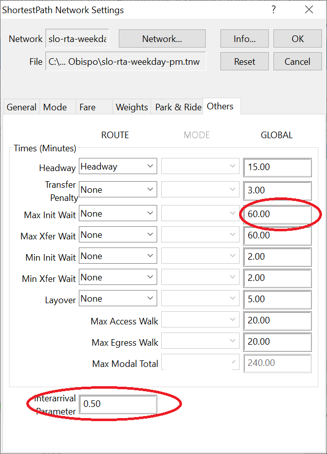

```{r setup, include=FALSE}
knitr::opts_chunk$set(echo = TRUE)
```

# Overview

This page presents an approach to generating road network skims for Analysis 
Assignment 4. Most of the instruction here is in the form of short videos, 
totalling about 23 minutes.

# Step 1: Download the GTFS feed for the transit network

This will be a zipped file containing several text files. You can usually
find the most recent version on the transit agency's website. Here are
some links for the study areas folks are working with this year:

* [Buffalo](https://www.nfta.com/metro/__googletransit/google_transit.zip)
* [Honolulu](http://webapps.thebus.org/transitdata/Production/google_transit.zip)
* [Jacksonville](https://schedules.jtafla.com/SchedulesGtfs/Download)
* [Okalahoma City](https://embarkok.com/data/gtfs/google_transit.zip)
* [Rochester](http://scheduledata.rgrta.com/google_transit.zip)

Check the contents of the zipped folder. You may find that there's a folder within the 
zipped folder, and that subfolder contains all the text files (I ran into this with 
the Jacksonville example). If that's the case, extract those text files zip them
into a new folder, so they're at the top level of a zipped folder.

# Step 2: Import transit routes and schedules from GTFS

Here is a video demonstrating how to import a GTFS feed into TransCAD.

[Importing GTFS feed to TransCAD](https://harvard.zoom.us/rec/share/Ugw0Zsuu-E-f7DNHfFtF8gCQ5QEOG26aA8LsbcDUgSEtFn0cnGn9gTRE5p7HyiDM.lJR8ZDYX5QYyG4Fy?startTime=1675713801000){target="_blank"} (3:01)

# Step 3: Calculate average route headways

Here is a video demonstrating how to calculate average headways for the routes
in your transit network.

[Calculating average headways](https://harvard.zoom.us/rec/share/dZyMmKcWZCmgNZV7eya3Tmewxo7SDm1j-8_z5pVxC-I4ZosscVArGiuic_qeNASJ.nmhwFT9EALhGQEIS?startTime=1675714066000){target="_blank"} (3:22) 

# Step 4: Add centroids and connectors to line layer

Here is a video reviewing how to add centroids and centroid connectors to a line 
layer.

[Adding centroid connectors](https://harvard.zoom.us/rec/share/CuB1oADC_WH1zbTB0NAoJsVKzRMHne_LfePrSa4AKtseF0-U5XSu1yGkRYW7ntS_._CJd-WLji0lOBnut?startTime=1675714790000){target="_blank"} (3:38) 

# Step 5: Tag stops to nodes

To build the public transit network from your routes layer, you will need to identify
which stops (associated with the the routes layer) are closest to which nodes (associated
with the line layer). Here is a video demonstrating how to tag stops to nodes.

[Tagging stops to nodes](https://harvard.zoom.us/rec/share/cepVQxl0Gks0GQLwPmVaRjiiPn578rL40lHcKMN4uZWavN2DMYZnQ2K_hU-f_CFV.qTIZkcgYLLSqUuW3?startTime=1675715297000){target="_blank"} (1:47) 

# Step 6: Calculate link walk times and in-vehicle travel times

You'll need to set values for each of three fields in the link file: 

* In-vehicle travel time (IVTT) (the time it takes for a transit vehicle to traverse a link)
* Walk time (the time it takes to walk along a link)
* Walk mode (an ID indicating the mode used to access transit)

Here is a video demonstrating how to set those values.

[Specifying link travel times](https://harvard.zoom.us/rec/share/NS_cFGf4iZId6cIDHiXBgnzcfPyffoTmgzU1pjM0SgfKS7PrjHD9rjcfvV1EVxQ.39jFsnq2IExMEIZU?startTime=1675716021000){target="_blank"} (3:01) 

# Step 7: Create a public transport network

Now you are ready to create the network file. Here's a video that demonstrates how to do that.

[Creating a transit network](https://harvard.zoom.us/rec/share/RGZ2Qa_YblSLK9XSYVSAyuzDS1l6CYdJLg-QqwA2oMdxZWuUlap18tUYaCt6Vc5P.udvmHhla4p5cY8bc?startTime=1675716251000){target="_blank"} (1:41) 

# Step 8: Skim the public transport network

And finally, you can skim the public transit network.

[Skimming a transit network](https://harvard.zoom.us/rec/share/SmF30zovUkzikfceJpNN4_pk4DrBfNpGwNF9_g9AA8IAi5QnF6cNok53WrXIHJOi.RZH09Y3wlZ1Lp8Sf?startTime=1675716496000){target="_blank"} (6:26)

One quick note that isn't covered in the video above: There are two 
parameters you can set on the "other" tab of the Network Settings
dialog (about 2:30 in the video above) that can make a big difference to
to your total travel time and waiting time estimates. These are the 
global value for the maximum initial wait time and the interarrival parameter.



The interarrival parameter is set to 0.5 by default, and this means that
passengers arrive randomly at transit stops, and their average wait
time is half of the headway. This is a good assumption for frequent
service where people just show up at a stop without checking a transit 
schedule first. For infrequent service, it might be better to assume 
that people do check the schedule and time their arrivals, rather than 
showing up an hour early to catch a bus that comes every two hours. You 
can account for this by setting a maximum wait time. 

If you set a value of 15 here, that will mean that if headways are less 
than 30 minutes, people will wait for half of the headway, but if 
headways are more than 30 minutes, they won't wait longer than 15 
minutes.

# Visualization: Displaying transit routes in R

You can use the `tidytransit` package to visualize the transit 
network using R.

```{r, message=FALSE, results='hide'}
library(tidyverse)
library(tidytransit)
library(here)
library(ggthemes)
library(tigris)

slo_tracts <- tracts(state = "CA", county = "San Luis Obispo")

slo_rta_gtfs <- read_gtfs(
  "http://slo.connexionz.net/rtt/public/resource/gtfs.zip")

route_shapes <- shapes_as_sf(slo_rta_gtfs$shapes)

ggplot() +
  geom_sf(data = slo_tracts,
          fill = "cornsilk",
              color = "gray") +
  geom_sf(data = route_shapes,
          aes(color = shape_id)) +
  theme_map() +
  theme(legend.position = "none")
```

# Visualization: Importing Excel sheets to R

You can also bring your transit skim matrix into R after exporting it from 
TransCAD to an Excel workbook.

Here is a video on how to export a matrix as an Excel workbook (with rows
and columns labeled with census tract GEOIDs).

[Labeling and exporting a matrix](https://harvard.zoom.us/rec/share/yHLbTXt2CMloCup692i_8sIcv1d-1_g_YpeezJXCN_95OpeRevyjp4zkR7fHWxil.Vcr2sXEmGec9RFuo?startTime=1675875186000){target="_blank"}(5:50)

And then you can read the Excel workbook into R.

```{r}
library(readxl)

IVTT <- here("Examples",
             "San Luis Obispo",
             "slo-rta-skims.xlsx") %>%
  read_xlsx(sheet = "In-Vehicle Time")

total_time <- here("Examples",
             "San Luis Obispo",
             "slo-rta-skims.xlsx") %>%
  read_xlsx(sheet = "Total Time")

transfers <- here("Examples",
             "San Luis Obispo",
             "slo-rta-skims.xlsx") %>%
  read_xlsx(sheet = "Number of Transfers")
```

Each matrix is now a dataframe with 43 rows (the number of tracts with 
transit access) and 44 columns (one for each tract, and one with the name of 
the origin tract).

# Visualization: Pivoting a skim matrix

It might be more useful to have each origin-destination pair on a separate
row, with columns representing the number of transfers, the total travel time, 
and the in-vehicle travel time.

```{r, warning=FALSE, message=FALSE}
transfers_long <- transfers %>%
  pivot_longer(cols = -GEOID) %>%
  mutate(value = as.numeric(value)) %>%
  rename(from_GEOID = GEOID,
         to_GEOID = name,
         n_transfers = value)

IVTT_long <- IVTT %>%
  pivot_longer(cols = -GEOID) %>%
  mutate(value = as.numeric(value)) %>%
  rename(from_GEOID = GEOID,
         to_GEOID = name,
         IVTT = value)


total_time_long <- total_time %>%
  pivot_longer(cols = -GEOID) %>%
  mutate(value = as.numeric(value)) %>%
  rename(from_GEOID = GEOID,
         to_GEOID = name,
         total_time = value)

full_skim <- full_join(IVTT_long, transfers_long) %>%
  full_join(total_time_long)
```

Here are the first few rows of the resulting dataframe:

```{r}
library(knitr)

head(full_skim) %>%
  kable()
```

# Visualization: Joining to census tracts

Maybe I want to visualize the transit access from the downtown transit center 
in San Luis Obispo, which is located in tract 06079011101. I can filter my skim
dataframe to only include trips from that location.

```{r, message=FALSE}
from_downtown <- full_skim %>%
  filter(from_GEOID == "06079011101") %>%
  select(-from_GEOID) %>%
  rename(GEOID = to_GEOID) 
  
from_dwntwn_tracts <- left_join(slo_tracts, from_downtown)

ggplot(from_dwntwn_tracts) +
  geom_sf(aes(fill = total_time)) +
  geom_sf(data = route_shapes) +
  scale_fill_viridis_c(name = 
    "Total travel time\nby transit from\ndowntown transit center") +
  theme_map()
```

